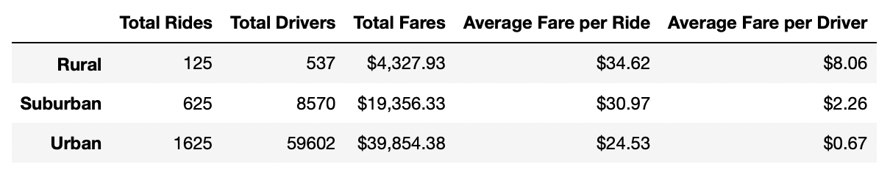
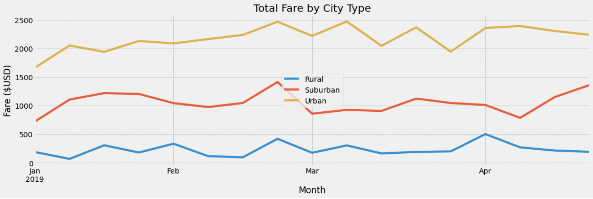

# PyBer_Analysis
### Using python, Pandas, and Matplotlib

## Overview 
This analysis was done for a ride-share company (PyBer), with the pressure on from an executive to prepare a presentation on a large amount of PyBer data. The analysis dives into the city types (rural, urban, suburban), and then looks further into the statistics of drivers and riders. This analysis shows the financial statistics that result from drivers and riders in each city type, which could give the PyBer company a better understanding of how to grow the business strategically, and if there are any current areas that need improvement when comparing the three city types.  

## Results
The summary of PyBer data when specifically focusing on city type, drivers, riders, and fares can be seen in the image below. 

### This image shows a lot of important statistics:
- The urban city type has a lot of use/traffic through the app. It brings in a revenue that nearly doubles the other two types combined.  However, the average ride is slightly cheaper, and there seems to be an influx of drivers which could potentially oversaturate the market.  They seem to making good money though in urban areas, and there will always be a need for the service in the urban areas due to less people relying on their own vehicles for day-to-day travel.
- The suburban city type has less drivers than riders (490 < 625), so they have great margins at $30.97 for average fare per ride and $39.50 for average fare per driver.  The only potential downside that this data shows for suburban cities is that there seems to be a bit of competition amongst the drivers, so even if the fares are higher, they will be getting less business.  
- The rural type shows high fare prices, but there are not many users in this demographic.  Even though the total fare revenue is low, there is potential in this area since ride prices can be higher.  Rides are likely to be further due to less businesses/housing that is close together in rural communities.  If this can be balanced out with a good ratio of supply/demand (riders/drivers), then they still have a lot of potential to make money in many rural communities.  

### The total fares by city types was further analyzed on the image below. 

This line graph shows that the urban cities bring in the most revenue, followed by suburban cities, and then rural areas.  This is expected based on population, as there are more users in higher-populated, urban areas.  Each city type shows the potential for spikes in revenue though, and it seems like late February is successful for all of the city types.  They all show potential for continued revenue streams, and suburban seems to have potential to keep climbing into May of 2019.  

## Summary
1. One recommendation I would make based on this data is to try to find more ways to capiolize on urban travel. It has the most traffic, but yet it has the lowest average fare prices.  There are multiple factors for this, including short trips/distances, lots of drivers at all times, and various others. There has to be a way to advocate for slightly higher prices without upsetting the customer base.  

2. Rural use of the app is low, but also the abundance of service is lacking a bit to those areas (lower drivers). There is money to be made in rural areas, but making sure to stay reasonable will be the key along with making sure there are enough drivers to satisfy the customer base.

3. Suburban cities have the potential to make a lot of money for the company. These areas are highly populated and show the potential for a reasonably-priced ride along with a high fare to the driver. Drivers will be very happy in the suburban areas, as long as there continues to be a supply of customers that use the app! 
